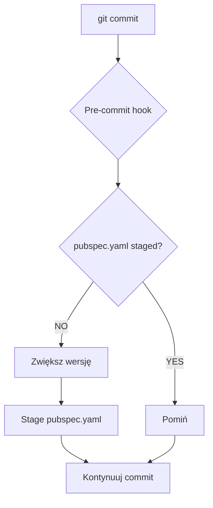

# 🎣 Git Hooks Guide

> Przewodnik po git hooks w TuneTangler

## 🎯 Co to są Git Hooks

Git hooks to skrypty, które automatycznie uruchamiają się w określonych momentach w git workflow:

- **pre-commit** – przed commitem
- **post-commit** – po commicie
- **pre-push** – przed push
- **post-merge** – po merge

## 🔄 Pre-commit Hook

### 📋 Opis

Pre-commit hook automatycznie zwiększa **patch version** w `pubspec.yaml` przed każdym commitem. To zapewnia, że każdy
commit ma unikalną wersję.

### 🎯 Cel

- **Automatyczne wersjonowanie** – nie musisz pamiętać o zwiększaniu wersji
- **Unikalne wersje** – każdy commit ma inną wersję
- **Spójność** – wersja zawsze odpowiada commitowi

## ⚙️ Instalacja

```bash
make install-pre-commit-hook
```

### 🗑️ Usunięcie

```bash
make remove-pre-commit-hook
```

## 🚀 Jak to działa

### 📝 Proces

1. **Przed każdym commit** – hook sprawdza czy `pubspec.yaml` jest już zmodyfikowany
2. **Jeśli NIE** – zwiększa patch version (np. 1.2.1 → 1.2.2)
3. **Jeśli TAK** – pomija (nie duplikuje zmian)
4. **Automatycznie stage** – zaktualizowany `pubspec.yaml`

### 🔄 Flow



## 📊 Przykłady

### 🔄 Przed commitem

```text
🔄 Pre-commit hook: Checking for version increment...
📋 Current version: 1.2.1
🆕 New version: 1.2.2
✅ Version incremented to 1.2.2 and staged for commit
💡 Commit message will include: version 1.2.2
```

### 📝 Po commicie

```bash
git log --oneline -1
grep '^version:' pubspec.yaml
```

**Output:**

- `abc1234 version 1.2.2`
- `version: 1.2.2+1`

### 🎯 Różne scenariusze

```bash
# 1. Pierwszy commit - wersja zostanie zwiększona
git commit -m "feat: add new feature"

# 2. pubspec.yaml już staged - wersja nie zmieni się
git add pubspec.yaml
git commit -m "chore: update version"

# 3. Tymczasowe wyłączenie
git commit --no-verify -m "wip: work in progress"
```

**Wyniki:**

- Version: 1.2.1 → 1.2.2
- Version: 1.2.2 (bez zmian)
- Hook pominięty

## ⚙️ Konfiguracja

### 🔧 Modyfikacja logiki

Edytuj `.git/hooks/pre-commit`:

```bash
# Patch increment (domyślnie)
NEW_PATCH=$((CURRENT_PATCH + 1))

# Minor increment
NEW_MINOR=$((CURRENT_MINOR + 1))

# Major increment  
NEW_MAJOR=$((CURRENT_MAJOR + 1))
```

### 🎯 Własne reguły

```bash
# Możesz dodać własne sprawdzenia:
# - Formatowanie kodu
# - Testy
# - Linting
# - Sprawdzanie commit message
```

## 🔍 Sprawdzenie statusu

### ✅ Czy hook jest aktywny

```bash
ls -la .git/hooks/pre-commit
file .git/hooks/pre-commit
cat .git/hooks/pre-commit
```

**Sprawdź:**

- Czy hook istnieje
- Uprawnienia
- Zawartość

### 🔍 Test hooka

```bash
git add .
git commit -m "test: test pre-commit hook"
grep '^version:' pubspec.yaml
```

**Kroki:**

1. Zmień wersję w pubspec.yaml
2. Zrób commit
3. Sprawdź, czy wersja została zwiększona

## ⚠️ Uwagi

### 🔒 Bezpieczeństwo

- **Hook działa lokalnie** – każdy developer musi go zainstalować
- **Nie commitować** – hook jest w `.gitignore`
- **Backup** – hook tworzy `.bak` plik (automatycznie usuwany)

### 📱 Zachowanie

- **Git add** – hook automatycznie stage'uje zmiany
- **Commit message** – hook dodaje informację o wersji
- **Build number** – automatycznie zwiększany

### 🚫 Ograniczenia

- **Tylko patch version** – minor i major muszą być ręczne
- **Tylko pubspec.yaml** – inne pliki nie są modyfikowane
- **Lokalny** – nie synchronizuje się z remote

## 🚨Jeśli coś nie działa

### ❌ Hook nie działa

```bash
chmod +x .git/hooks/pre-commit
ls -la .git/hooks/
cat .git/hooks/pre-commit
make remove-pre-commit-hook
make install-pre-commit-hook
```

**Kroki:**

1. Sprawdź uprawnienia
2. Sprawdź, czy jest w .git/hooks/
3. Sprawdź zawartość
4. Reinstalacja przez Makefile

### ❌ Błąd sed

```bash
brew install gnu-sed
```

**Lub zmień** `sed -i.bak` na `sed -i ''` w skrypcie

### ❌ Konflikt wersji

```bash
git checkout -- pubspec.yaml
git add pubspec.yaml
git commit
```

**Ręcznie rozwiąż** w pubspec.yaml

### ❌ Hook pominięty

```bash
git log --oneline -1
ls -la .git/hooks/pre-commit
```

**Sprawdź:**

- Czy --no-verify nie został użyty
- Czy hook jest aktywny

### 🔍 Debugging

Uruchom hook ręcznie

```bash
.git/hooks/pre-commit
```

Sprawdź logi

```bash
git commit -m "test" 2>&1 | grep "Pre-commit hook"
```

## 📚 Dodatkowe Zasoby

- **[🔨 Makefile](MAKEFILE.md)** – Komendy do zarządzania hooks
- **[📖 Development Guide](../README.md)** – Główny przewodnik
- **[Git Hooks Documentation](https://git-scm.com/docs/githooks)** – Oficjalna dokumentacja
- **[Pre-commit Framework](https://pre-commit.com/)** – Zaawansowane git hooks

## 🆘 Potrzebujesz Pomocy?

1. **📖 Sprawdź dokumentację** – może już jest odpowiedź
2. **🔍 Użyj wyszukiwania** – Ctrl+F w plikach
3. **🐛 Zgłoś issue** – [GitHub Issues](https://github.com/Flower7C3/tune-tangler/issues)
4. **💬 Dyskutuj** – [GitHub Discussions](https://github.com/Flower7C3/tune-tangler/discussions)
