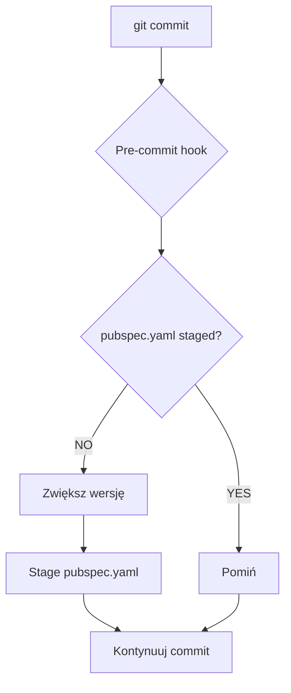

# 🎣 Git Hooks Guide

> Przewodnik po git hooks w TuneTangler

## 📋 Spis Treści

- [🎯 Co to są Git Hooks](#what-are-git-hooks)
- [🔄 Pre-commit Hook](#pre-commit-hook)
  - [📋 Opis](#description)
  - [🎯 Cel](#purpose)
- [⚙️ Instalacja](#installation)
  - [🗑️ Usunięcie](#removal)
- [🚀 Jak to działa](#how-it-works)
  - [📝 Proces](#process)
  - [🔄 Flow](#flow)
- [📊 Przykłady](#examples)
  - [🔄 Przed commitem](#before-commit)
  - [📝 Po commicie](#after-commit)
  - [🎯 Różne scenariusze](#different-scenarios)
- [🔍 Sprawdzenie statusu](#status-check)
  - [✅ Czy hook jest aktywny](#is-hook-active)
  - [🔍 Test hooka](#test-hook)
- [⚠️ Uwagi](#notes)
  - [🔒 Bezpieczeństwo](#security)
  - [📱 Zachowanie](#behavior)
  - [🚫 Ograniczenia](#limitations)
- [🚨Jeśli coś nie działa](#troubleshooting)
  - [❌ Hook nie działa](#hook-not-working)
  - [❌ Błąd sed](#sed-error)
  - [❌ Konflikt wersji](#version-conflict)
  - [❌ Hook pominięty](#hook-skipped)
  - [🔍 Debugging](#debugging)
- [📚 Dodatkowe Zasoby](#additional-resources)
- [🆘 Potrzebujesz Pomocy?](#need-help)

## 🎯 Co to są Git Hooks <a name="what-are-git-hooks"></a>

Git hooks to skrypty, które automatycznie uruchamiają się w określonych momentach w git workflow:

- **pre-commit** – przed commitem
- **post-commit** – po commicie
- **pre-push** – przed push
- **post-merge** – po merge

## 🔄 Pre-commit Hook <a name="pre-commit-hook"></a>

### 📋 Opis <a name="description"></a>

Pre-commit hook automatycznie zwiększa **patch version** w `pubspec.yaml` przed każdym commitem. To zapewnia, że każdy
commit ma unikalną wersję.

### 🎯 Cel <a name="purpose"></a>

- **Automatyczne wersjonowanie** – nie musisz pamiętać o zwiększaniu wersji
- **Unikalne wersje** – każdy commit ma inną wersję
- **Spójność** – wersja zawsze odpowiada commitowi

## ⚙️ Instalacja <a name="installation"></a>

```bash
make install-pre-commit-hook
```

### 🗑️ Usunięcie <a name="removal"></a>

```bash
make remove-pre-commit-hook
```

## 🚀 Jak to działa <a name="how-it-works"></a>

### 📝 Proces <a name="process"></a>

1. **Przed każdym commit** – hook sprawdza czy `pubspec.yaml` jest już zmodyfikowany
2. **Jeśli NIE** – zwiększa patch version (np. 1.2.1 → 1.2.2)
3. **Jeśli TAK** – pomija (nie duplikuje zmian)
4. **Automatycznie stage** – zaktualizowany `pubspec.yaml`

### 🔄 Flow <a name="flow"></a>



## 📊 Przykłady <a name="examples"></a>

### 🔄 Przed commitem <a name="before-commit"></a>

```text
🔄 Pre-commit hook: Checking for version increment...
📋 Current version: 1.2.1
🆕 New version: 1.2.2
✅ Version incremented to 1.2.2 and staged for commit
💡 Commit message will include: version 1.2.2
```

### 📝 Po commicie <a name="after-commit"></a>

```bash
git log --oneline -1
grep '^version:' pubspec.yaml
```

**Output:**

- `abc1234 version 1.2.2`
- `version: 1.2.2+1`

### 🎯 Różne scenariusze <a name="different-scenarios"></a>

```bash
# 1. Pierwszy commit - wersja zostanie zwiększona
git commit -m "feat: add new feature"

# 2. pubspec.yaml już staged - wersja nie zmieni się
git add pubspec.yaml
git commit -m "chore: update version"

# 3. Tymczasowe wyłączenie
git commit --no-verify -m "wip: work in progress"
```

**Wyniki:**

- Version: 1.2.1 → 1.2.2
- Version: 1.2.2 (bez zmian)
- Hook pominięty

## 🔍 Sprawdzenie statusu <a name="status-check"></a>

### ✅ Czy hook jest aktywny <a name="is-hook-active"></a>

```bash
ls -la .git/hooks/pre-commit
file .git/hooks/pre-commit
cat .git/hooks/pre-commit
```

**Sprawdź:**

- Czy hook istnieje
- Uprawnienia
- Zawartość

### 🔍 Test hooka <a name="test-hook"></a>

```bash
git add .
git commit -m "test: test pre-commit hook"
grep '^version:' pubspec.yaml
```

**Kroki:**

1. Zmień wersję w pubspec.yaml
2. Zrób commit
3. Sprawdź, czy wersja została zwiększona

## ⚠️ Uwagi <a name="notes"></a>

### 🔒 Bezpieczeństwo <a name="security"></a>

- **Hook działa lokalnie** – każdy developer musi go zainstalować
- **Nie commitować** – hook jest w `.gitignore`
- **Backup** – hook tworzy `.bak` plik (automatycznie usuwany)

### 📱 Zachowanie <a name="behavior"></a>

- **Git add** – hook automatycznie stage'uje zmiany
- **Commit message** – hook dodaje informację o wersji
- **Build number** – automatycznie zwiększany

### 🚫 Ograniczenia <a name="limitations"></a>

- **Tylko patch version** – minor i major muszą być ręczne
- **Tylko pubspec.yaml** – inne pliki nie są modyfikowane
- **Lokalny** – nie synchronizuje się z remote

## 🚨Jeśli coś nie działa <a name="troubleshooting"></a>

### ❌ Hook nie działa <a name="hook-not-working"></a>

Sprawdź [Git Hooks Troubleshooting](https://git-scm.com/docs/githooks#_troubleshooting)

### ❌ Błąd sed <a name="sed-error"></a>

Sprawdź [sed documentation](https://www.gnu.org/software/sed/manual/) lub użyj alternatywnych narzędzi

### ❌ Konflikt wersji <a name="version-conflict"></a>

Sprawdź [Git Conflict Resolution](https://git-scm.com/book/en/v2/Git-Branching-Basic-Branching-and-Merging#_basic_merge_conflicts)

### ❌ Hook pominięty <a name="hook-skipped"></a>

Sprawdź [Git Commit Options](https://git-scm.com/docs/git-commit#Documentation/git-commit.txt---no-verify)

### 🔍 Debugging <a name="debugging"></a>

Sprawdź [Git Debugging Guide](https://git-scm.com/book/en/v2/Git-Tools-Debugging)

## 📚 Dodatkowe Zasoby <a name="additional-resources"></a>

- **[🔨 Makefile](QUICKSTART.md#makefile)** – Komendy do zarządzania hooks
- **[📖 Development Guide](../README.md)** – Główny przewodnik
- **[Git Hooks Documentation](https://git-scm.com/docs/githooks)** – Oficjalna dokumentacja
- **[Pre-commit Framework](https://pre-commit.com/)** – Zaawansowane git hooks

## 🆘 Potrzebujesz Pomocy? <a name="need-help"></a>

1. **📖 Sprawdź dokumentację** – może już jest odpowiedź
2. **🔍 Użyj wyszukiwania** – Ctrl+F w plikach
3. **🐛 Zgłoś issue** – [GitHub Issues](https://github.com/Flower7C3/tune-tangler/issues)
4. **💬 Dyskutuj** – [GitHub Discussions](https://github.com/Flower7C3/tune-tangler/discussions)
