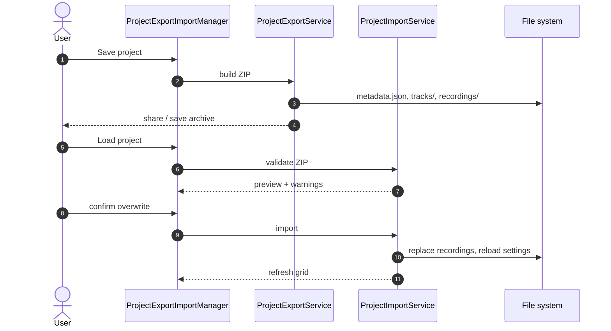
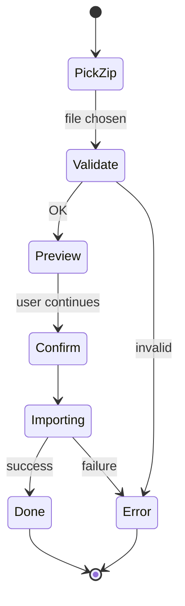

# 📦 Project export and import

> Save and restore the full app session (grid, tracks, recordings) as a ZIP archive.

## 📋 Table of contents

- [🌐 Overview](#overview)
- [✨ Features](#features)
  - [📤 Export](#export)
  - [📥 Import](#import)
- [⚙️ Technical details](#technical-details)
- [🎨 UI/UX](#ui-ux)
- [🌐 Localization](#localization)
- [🐛 Fixed issues](#fixed-issues)
- [📂 Related source files](#related-source-files)
- [🔗 See also](#see-also)

---

## 🌐 Overview 

Export/import saves the full app state (grid, all tracks with recordings) to a ZIP file and restores it later with validation and an import preview.

## ✨ Features 

### 📤 Export 

- **Location:** main menu (AppBar) → “Save project”
- **Filename pattern:** `tune_tangler_project_[name]_YYYYMMDD_HHMMSS.zip`
- **ZIP contents:**
  - `metadata.json` — project metadata (version, export time, stats, track list)
  - `settings/grid_settings.json` — grid row/column counts
  - `tracks/[TrackId].json` — per-track settings (all fields from `Track.toMap()`)
  - `recordings/[TrackId].[ext]` — audio files
  - `recordings/checksums.json` — SHA256 checksums for recordings

### 📥 Import 

- **Location:** main menu (AppBar) → “Load project”
- **Flow:**
  1. Pick a ZIP via `file_picker`
  2. **Validation** (no data mutation yet):
     - ZIP structure
     - JSON validity (metadata, settings, tracks)
     - Recording checksums
     - File sizes vs metadata
  3. **Preview:**
     - Project name
     - Export time
     - Grid size (with derived track count)
     - Stats (tracks with audio, total recording size)
  4. **Warning:** session overwrite notice
  5. **Import** (after confirm):
     - Remove existing recordings
     - Reset all tracks to defaults
     - Import grid settings
     - Import all track settings
     - Import recordings with checksum verification
     - Refresh UI

## ⚙️ Technical details 

### 📤 Export

- **Code:** [`lib/service/project_export_service.dart`](../../lib/service/project_export_service.dart)
- **UI coordinator:** [`lib/manager/project_export_import_manager.dart`](../../lib/manager/project_export_import_manager.dart)
- **Serialization:**
  - `TrackId` → `[row, col]` list
  - `Duration` → milliseconds (`int`)
  - Strip control characters from track names
  - UTF-8 for all JSON files

### 📥 Import

- **Code:** [`lib/service/project_import_service.dart`](../../lib/service/project_import_service.dart)
- **Validation:** complete validation before any mutation
- **Errors:**
  - Detailed user-facing errors
  - Warnings for non-fatal issues
  - Checksum and size checks
- **Trim:** correct handling of `playbackStartAtPosition` / `playbackEndAtPosition`:
  - Persist values before `setPath()`
  - Restore after file load completes
  - Ensure `playbackEndAtPosition` does not exceed file `duration`

### 🔄 UI refresh

- **Cache:** clear `LazyLoadingManager` cache after import
- **State:**
  - `HiveSettingsProvider.reload()` — bump version + `notifyListeners()`
  - `context.watch<HiveSettingsProvider>()` in `MainScreenApp` for rebuilds
  - Widget keys include version to force `ListView.builder` rebuild

## 🎨 UI/UX 

### 👁️ Preview

- **Icons:** calendar (`Icons.calendar_today_rounded`), storage (`Icons.storage_rounded`), grid (`Icons.grid_4x4_rounded`)
- Grid size line also shows derived track count (e.g. `6 x 4 (24 tracks)`)
- NBSP in translations for stable wrapping

### 💬 Dialogs

- Progress during validation/import
- Error list after failed import
- Overwrite warning before import proceeds

## 🌐 Localization 

- Keys for all export/import strings
- NBSP (`\u00A0`) before units (MB, min, Hz, kbps) and in Polish phrasing where needed
- Clearer overwrite warnings for track settings

## 🐛 Fixed issues 

1. **Trim not applied on import** — save before `setPath()`, restore after load
2. **UI stale after import** — cache clear + `context.watch()`
3. **Spinning `CircularProgressIndicator`** — 5s timeout + wait logic
4. **`FormatException` from control chars** — sanitize on export/import
5. **Missing recordings on import** — metadata mapping → filename → `trackId` matching

## 📂 Related source files 

- [`lib/service/project_export_service.dart`](../../lib/service/project_export_service.dart)
- [`lib/service/project_import_service.dart`](../../lib/service/project_import_service.dart)
- [`lib/manager/project_export_import_manager.dart`](../../lib/manager/project_export_import_manager.dart)
- [`lib/config/app_icon.dart`](../../lib/config/app_icon.dart)
- [`lib/l10n/app_*.arb`](../../lib/l10n/)

## 🔗 See also 

- [Shipped items](./COMPLETED.md)
- [Roadmap](./ROADMAP.md)
