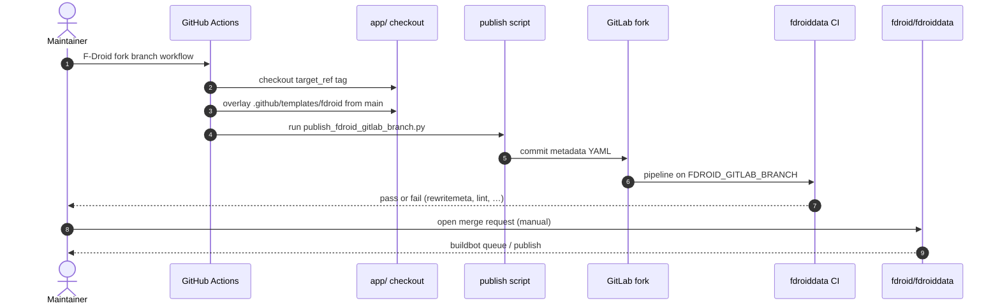
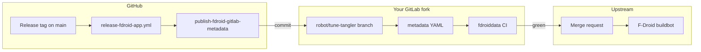
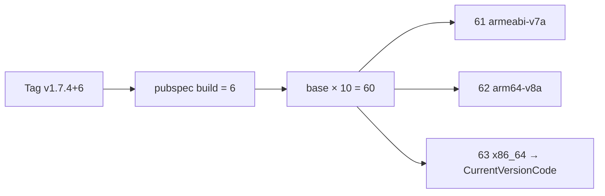

# 🦊 F-Droid publication (fdroiddata)

> Tune Tangler — `applicationId`: **`pro.kwiatek.tune_tangler`**, **MIT** ([`LICENSE`](../../LICENSE)).

F-Droid **builds and signs** APKs from source. This repository does **not** ship binaries to F-Droid directly: it maintains **metadata** for the fdroiddata index and pushes updates to **your GitLab fork**, then you open a **merge request** to upstream when CI is green.

- Upstream index: [fdroid/fdroiddata](https://gitlab.com/fdroid/fdroiddata)
- Upstream metadata example: [metadata/pro.kwiatek.tune_tangler.yml](https://gitlab.com/fdroid/fdroiddata/-/blob/master/metadata/pro.kwiatek.tune_tangler.yml)

## 📋 Table of contents

- [🌐 Overview](#overview)
- [📁 Repository layout](#repository-layout)
- [🔧 One-time configuration](#one-time-configuration)
  - [🔐 GitHub secrets and variables](#github-secrets-and-variables)
  - [🍴 Fork and upstream](#fork-and-upstream)
- [📝 Project files you edit](#files-you-edit)
- [⚙️ How it works](#how-it-works)
  - [📊 Publish pipeline (diagram)](#publish-pipeline-diagram)
  - [🔢 ABI version codes (diagram)](#abi-version-codes-diagram)
- [✅ Operator checklist](#operator-checklist)
- [🏪 Listings: Fastlane vs metadata YAML](#listings-fastlane-vs-metadata-yaml)
- [🏷️ Versioning and ABI builds](#versioning-and-abi-builds)
- [🧪 fdroiddata CI on your fork](#fdroiddata-ci-on-your-fork)
- [🚨 Troubleshooting](#troubleshooting)
- [📚 Official F-Droid documentation](#official-f-droid-documentation)
- [🔗 Related docs in this repo](#related-docs-in-this-repo)
- [📦 Native dependencies (Android)](#native-dependencies)

---

## 🌐 Overview 

| Layer | Role |
|-------|------|
| **This app repo** | Source code, Fastlane store text, Flutter pin ([`pubspec.yaml`](../../pubspec.yaml)), signing for GitHub Releases |
| **Your fdroiddata fork** | Metadata YAML on branch **`robot/tune-tangler`** (default); path `metadata/pro.kwiatek.tune_tangler.yml` |
| **Upstream fdroiddata** | Index + buildbot; merge request after your fork CI passes |
| **F-Droid users** | Install from the F-Droid client / website |

**Automation path:** GitHub [`release-fdroid-app.yml`](../../.github/workflows/release-fdroid-app.yml) → [`publish-fdroid-gitlab-metadata`](../../.github/actions/publish-fdroid-gitlab-metadata/action.yml) → commit on your fork → GitLab CI (`rewritemeta`, `lint`, `checkupdates`, …) → **you** open the upstream MR manually.

More context: [GitHub workflows — F-Droid](../development/WORKFLOWS.md#release-fdroid-app), [operator runbook](../development/WORKFLOWS.md#operator-runbook).

## 📁 Repository layout 

| Path | Purpose |
|------|---------|
| [`/.github/workflows/release-fdroid-app.yml`](../../.github/workflows/release-fdroid-app.yml) | Manual workflow: publish metadata for a tag |
| [`/.github/actions/publish-fdroid-gitlab-metadata/action.yml`](../../.github/actions/publish-fdroid-gitlab-metadata/action.yml) | Composite action (checkout, overlay templates, Python publish) |
| [`/.github/actions/publish-fdroid-gitlab-metadata/publish_fdroid_gitlab_branch.py`](../../.github/actions/publish-fdroid-gitlab-metadata/publish_fdroid_gitlab_branch.py) | Builds/updates YAML, pushes to GitLab fork |
| [`/.github/actions/publish-fdroid-gitlab-metadata/fdroid_yaml_dump.py`](../../.github/actions/publish-fdroid-gitlab-metadata/fdroid_yaml_dump.py) | Serializes metadata like `fdroid rewritemeta` (ruamel.yaml) |
| [`/.github/templates/fdroid/metadata_static.yml`](../../.github/templates/fdroid/metadata_static.yml) | Bootstrap skeleton + **MaintainerNotes** (applied every publish) |
| [`/.github/templates/fdroid/build_template.yml`](../../.github/templates/fdroid/build_template.yml) | One **Build** entry template → three ABI rows per release |
| [`/android/app/build.gradle`](../../android/app/build.gradle) | `versionCodeOverride` for split APKs (×10 + ABI slot) |
| [`/fastlane/metadata/android/en-US/`](../../fastlane/metadata/android/en-US/) | Store listings (required for publish) |

```mermaid
flowchart TB
  subgraph action [".github/actions/publish-fdroid-gitlab-metadata/"]
    PY[publish_fdroid_gitlab_branch.py]
    DUMP[fdroid_yaml_dump.py]
    PY --> DUMP
  end
  subgraph templates [".github/templates/fdroid/"]
    STATIC[metadata_static.yml]
    BUILD[build_template.yml]
  end
  subgraph app_repo ["App repo at release tag"]
    PUB[pubspec.yaml + .metadata]
    FL[fastlane/metadata/android/]
    GRADLE[android/app/build.gradle]
  end
  templates --> PY
  app_repo --> PY
  PY -->|GitLab API| FORK[(fdroiddata fork YAML)]
```

## 🔧 One-time configuration 

Do these steps **once per GitHub repository** (and once per fdroiddata fork). Day-to-day releases only need the [operator checklist](#operator-checklist).

### 🔐 GitHub secrets and variables 

Configure on the **same GitHub repository** that runs the workflow (if you use a fork of Tune Tangler, set secrets/variables **on that fork**).

**Secrets** (Settings → Secrets and variables → Actions → **Secrets**):

| Name | Description |
|------|-------------|
| **`GITLAB_TOKEN`** | GitLab PAT with **`api`** scope and write access to **your** fdroiddata fork |

**Variables** (Settings → **Variables**):

| Name | Required | Default (Tune Tangler) | Description |
|------|----------|------------------------|-------------|
| **`GITLAB_FORK_PROJECT_ID`** | ✅ | — | Numeric GitLab **project ID** of your fdroiddata fork |
| **`FDROID_METADATA_PATH`** | | `metadata/pro.kwiatek.tune_tangler.yml` | Path inside the fork repo |
| **`FDROID_GITLAB_BRANCH`** | | `robot/tune-tangler` | Branch on the fork that receives automation commits |
| **`FDROID_GIT_COMMIT_SUBJECT_PREFIX`** | | `Tune Tangler` | First part of Git commit subject on the fork |
| **`FDROID_GITLAB_FORK_PARENT_REF`** | | `master` | Ref to read baseline metadata / start new fork branches |
| **`FDROID_GITLAB_COMPARE_BASE_REF`** | | same as fork parent | Left-hand side of GitLab compare URL in the job summary |

Empty optional variables fall back to defaults in [`publish-fdroid-gitlab-metadata/action.yml`](../../.github/actions/publish-fdroid-gitlab-metadata/action.yml).

### 🍴 Fork and upstream 

1. Fork [fdroid/fdroiddata](https://gitlab.com/fdroid/fdroiddata) on GitLab (public fork).
2. Note the fork **project ID** → GitHub variable **`GITLAB_FORK_PROJECT_ID`**.
3. Create a GitLab PAT with **`api`** scope → GitHub secret **`GITLAB_TOKEN`**.
4. Keep your fork **in sync** with upstream `master` to reduce merge request conflicts later.

## 📝 Project files you edit 

Per release or when changing build/listing policy (not part of [one-time configuration](#one-time-configuration)):

| When | Edit |
|------|------|
| **App identity / license / links / maintainer notes** | [`metadata_static.yml`](../../.github/templates/fdroid/metadata_static.yml) — especially **`MaintainerNotes`**, `Repo`, `License`, `Categories` |
| **Build recipe** (Flutter srclib, prebuild, `flutter build apk`) | [`build_template.yml`](../../.github/templates/fdroid/build_template.yml) — align with upstream Flutter template (see [official links](#official-f-droid-documentation)) |
| **Per-ABI version codes** | [`android/app/build.gradle`](../../android/app/build.gradle) and **`VercodeOperation`** in [`metadata_static.yml`](../../.github/templates/fdroid/metadata_static.yml) |
| **Flutter SDK for F-Droid builds** | [`pubspec.yaml`](../../pubspec.yaml) (`flutter_sdk_version`, synced with [`.metadata`](../../.metadata) via `make sdk-upgrade`) |
| **Store description & screenshots** | [`fastlane/metadata/android/…`](../../fastlane/metadata/android/) — see [Store listings](STORE_LISTINGS.md) |
| **Publish logic** (rare) | [`publish_fdroid_gitlab_branch.py`](../../.github/actions/publish-fdroid-gitlab-metadata/publish_fdroid_gitlab_branch.py), [`fdroid_yaml_dump.py`](../../.github/actions/publish-fdroid-gitlab-metadata/fdroid_yaml_dump.py) |

Do **not** put `Summary`, `Description`, `Name`, or `AutoName` in fdroiddata YAML — they **override** Fastlane; the publish script strips them if present.

## ⚙️ How it works 

### 📊 Publish pipeline (diagram) 

**High-level flow:**

**Publish steps** ([`publish_fdroid_gitlab_branch.py`](../../.github/actions/publish-fdroid-gitlab-metadata/publish_fdroid_gitlab_branch.py)):

1. Resolve **`target_ref`** (workflow input) or latest tag on default branch.
2. Check out the **release tree** into `app/` (pubspec, `.metadata`, Fastlane at that tag).
3. Overlay [`.github/templates/fdroid/`](../../.github/templates/fdroid/) from **default branch** into `app/` (so old tags still get current templates).
4. Run the publish script from the composite action (`github.action_path`); app paths use `GITHUB_WORKSPACE=app/`.
5. Read **version** from tag name (`v1.7.4+6`) or [`pubspec.yaml`](../../pubspec.yaml).
6. Require Fastlane **`en-US`** [`short_description.txt`](../../fastlane/metadata/android/en-US/short_description.txt) and [`full_description.txt`](../../fastlane/metadata/android/en-US/full_description.txt).
7. Load fork metadata from **`FDROID_GITLAB_FORK_PARENT_REF`**; if missing, bootstrap from [`metadata_static.yml`](../../.github/templates/fdroid/metadata_static.yml).
8. Replace stale **`Builds`** for other `versionName` values; add **three** ABI builds from [`build_template.yml`](../../.github/templates/fdroid/build_template.yml).
9. Refresh **`MaintainerNotes`** from [`metadata_static.yml`](../../.github/templates/fdroid/metadata_static.yml).
10. Dump YAML via [`fdroid_yaml_dump.py`](../../.github/actions/publish-fdroid-gitlab-metadata/fdroid_yaml_dump.py) (byte-compatible with **`fdroid rewritemeta`**).
11. Push to **`FDROID_GITLAB_BRANCH`** on the fork (skip commit if file is already identical).

The workflow does **not** open an upstream merge request — only updates your fork branch.

### 🔢 ABI version codes (diagram) 

## ✅ Operator checklist 

1. **Merge to `main`** and wait for [version & tag](../development/WORKFLOWS.md#version-tag-main) (or ensure the release **tag** already exists).
2. **Actions** → **F-Droid fork branch (fdroiddata)** → run with optional **`target_ref`** (empty = latest tag).
3. Open **pipelines** / **compare** links in the job summary; wait for **GitLab CI** on `FDROID_GITLAB_BRANCH` to pass.
4. In GitLab: **merge request** from your fork branch → [fdroid/fdroiddata](https://gitlab.com/fdroid/fdroiddata) **`master`** — use the [App update MR template](https://gitlab.com/fdroid/fdroiddata/-/blob/master/.gitlab/merge_request_templates/App%20update.md).
5. After upstream merge: F-Droid buildbot picks up the change (timing depends on the queue).

**Upstream MR requirements:** public fork; source branch **not** [protected](https://docs.gitlab.com/user/project/repository/branches/protected/) (maintainers rebase with fast-forward).

## 🏪 Listings: Fastlane vs metadata YAML 

| Source | Location | Used for |
|--------|----------|----------|
| **Fastlane / Triple-T** | [`fastlane/metadata/android/`](../../fastlane/metadata/android/) | Title, short/full description, graphics — read from the **tagged app commit** |
| **fdroiddata YAML** | [`metadata_static.yml`](../../.github/templates/fdroid/metadata_static.yml) on fork | License, repo URLs, build recipe, maintainer notes — **not** store listing text |

Details: [Store listings (F-Droid)](STORE_LISTINGS.md).

External reference:

- [F-Droid — All About Descriptions, Graphics, and Screenshots](https://f-droid.org/en/docs/All_About_Descriptions_Graphics_and_Screenshots/)

## 🏷️ Versioning and ABI builds 

- **Tag / pubspec:** `MAJOR.MINOR.PATCH+BUILD` (e.g. `v1.7.4+6` → versionName `1.7.4`, base build `6`).
- **Three APKs:** `armeabi-v7a`, `arm64-v8a`, `x86_64` via `--split-per-abi` in [`build_template.yml`](../../.github/templates/fdroid/build_template.yml).
- **versionCode:** `pubspec build × 10 + {1,2,3}` in [`android/app/build.gradle`](../../android/app/build.gradle); **`CurrentVersionCode`** = highest slot (+3).
- **`VercodeOperation`:** `%c * 10 + 1` … `+ 3` in [`metadata_static.yml`](../../.github/templates/fdroid/metadata_static.yml) for autoupdate.
- **Pubspec `+build` must only increase** across releases; remove obsolete Git tags that imply a higher vercode than your current release (confuses **`checkupdates`**).

Autoupdate: **`AutoUpdateMode: Version`**, **`UpdateCheckMode: Tags`**, **`UpdateCheckData`** on [`pubspec.yaml`](../../pubspec.yaml).

## 🧪 fdroiddata CI on your fork 

Your fork pipeline validates the metadata file before you propose upstream:

| Check | What it enforces |
|-------|------------------|
| **`fdroid rewritemeta`** | Canonical YAML 1.2 layout — must match [`fdroid_yaml_dump.py`](../../.github/actions/publish-fdroid-gitlab-metadata/fdroid_yaml_dump.py) output |
| **`fdroid lint`** | fdroiddata JSON schema (`schemas/metadata.json`) |
| **`checkupdates`** | `CurrentVersion` / `CurrentVersionCode` consistent with latest **tags** on `Repo` |
| **`git redirect`** | `Repo:` must be a stable Git URL ending in `.git` (script normalizes GitHub smart-HTTP URLs) |

Schema and field reference (external):

- [fdroiddata metadata schema](https://gitlab.com/fdroid/fdroiddata/-/blob/master/schemas/metadata.json)
- [Build metadata reference](https://f-droid.org/en/docs/Build_Metadata_Reference/)

## 🚨 Troubleshooting 

### ❌ `GITLAB_TOKEN` or `GITLAB_FORK_PROJECT_ID` missing

1. Confirm the failed run’s **repository** (fork vs upstream) — secrets/variables are per repo.
2. **`GITLAB_TOKEN`:** Actions **secret**, name exactly `GITLAB_TOKEN`, `api` scope, access to your fork.
3. **`GITLAB_FORK_PROJECT_ID`:** Actions **variable**, numeric project ID only.
4. Org secrets/variables: grant this repository access.
5. Re-run the workflow (no code change needed).

### ❌ GitLab job `rewritemeta` fails (YAML diff)

The generated file must be **byte-identical** to what `fdroid rewritemeta` would write.

| Symptom | Fix |
|---------|-----|
| Extra/missing blank lines between sections | Regenerate with current [`fdroid_yaml_dump.py`](../../.github/actions/publish-fdroid-gitlab-metadata/fdroid_yaml_dump.py); re-run GitHub workflow |
| Long `prebuild` / `build` lines split across two YAML lines | Fixed in dumper (`width = 4096`); update action and re-publish |
| `MaintainerNotes: \|-` vs `\|` | Notes must end with a newline in [`metadata_static.yml`](../../.github/templates/fdroid/metadata_static.yml) |

### ❌ `checkupdates` — wrong `CurrentVersion` / `CurrentVersionCode`

- Usually **stale or conflicting Git tags** on the app repo (e.g. old `v1.7.0+8` with higher vercode than `v1.7.4+6`).
- Delete misleading tags on GitHub; ensure latest tag matches the release you publish.
- Fork branch should not keep old **`versionName`** rows — publish script removes them; re-run workflow from current **`main`**.

### ❌ `git redirect` / `Repo` URL

Use **`https://github.com/OWNER/REPO.git`** in [`metadata_static.yml`](../../.github/templates/fdroid/metadata_static.yml). The publish script adds `.git` for GitHub smart-HTTP URLs.

### ❌ Fastlane files missing

Publish requires [`short_description.txt`](../../fastlane/metadata/android/en-US/short_description.txt) and [`full_description.txt`](../../fastlane/metadata/android/en-US/full_description.txt) at the **release commit**. Add them under `fastlane/metadata/android/<locale>/` before tagging.

### ❌ `flutter_sdk_version` / `.metadata` mismatch

Run `make sdk-upgrade`, commit [`pubspec.yaml`](../../pubspec.yaml) and [`.metadata`](../../.metadata), then tag and publish again.

### ❌ F-Droid buildbot rejects the recipe

Compare [`build_template.yml`](../../.github/templates/fdroid/build_template.yml) with upstream [fdroiddata `templates/build-flutter.yml`](https://gitlab.com/fdroid/fdroiddata/-/blob/master/templates/build-flutter.yml). Adjust prebuild/srclibs, re-run the GitHub workflow.

### ❌ Upstream merge request conflicts

Rebase or merge **latest `fdroid/fdroiddata` `master`** into your fork before opening the MR. Delete obsolete automation branches on the fork if you renamed **`FDROID_GITLAB_BRANCH`**.

## 📚 Official F-Droid documentation 

- [Inclusion Policy](https://f-droid.org/en/docs/Inclusion_Policy/)
- [Build Metadata Reference](https://f-droid.org/en/docs/Build_Metadata_Reference/)
- [All About Descriptions, Graphics, and Screenshots](https://f-droid.org/en/docs/All_About_Descriptions_Graphics_and_Screenshots/)
- [Contributing to fdroiddata (CONTRIBUTING.md)](https://gitlab.com/fdroid/fdroiddata/-/blob/master/CONTRIBUTING.md)
- [fdroiddata metadata schema (schemas/metadata.json)](https://gitlab.com/fdroid/fdroiddata/-/blob/master/schemas/metadata.json)
- [fdroiddata Flutter build template (templates/build-flutter.yml)](https://gitlab.com/fdroid/fdroiddata/-/blob/master/templates/build-flutter.yml)
- [fdroidserver (build tools)](https://gitlab.com/fdroid/fdroidserver)

## 🔗 Related docs in this repo 

- [GitHub workflows guide](../development/WORKFLOWS.md#one-time-configuration) — CI secrets index
- [Release signing](RELEASE_SIGNING.md#one-time-configuration) — APK/AAB keystore (separate from F-Droid)
- [Store listings](STORE_LISTINGS.md) — Fastlane paths and F-Droid copy
- [Installation](INSTALLATION.md) — end-user install paths

## 📦 Native dependencies (Android) 

“Modified” audio export uses **MediaCodec** + **Sonic** ([`android/app/src/main/java/sonic/`](../../android/app/src/main/java/sonic/), Apache 2.0). Mentioned in [`metadata_static.yml`](../../.github/templates/fdroid/metadata_static.yml) **MaintainerNotes**.
